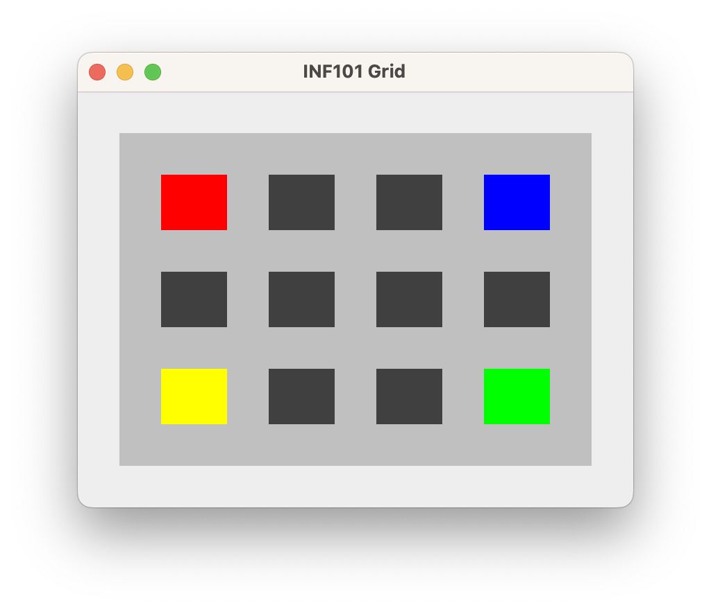

# Rutenett

I denne lab'en skal vi tegne et rutenett som vist over. Oppgaven består i hovedsak av tre deler:
1. Skriv en klasse `ColorGrid` som representerer et rutenett av farger.
2. Skriv en klasse `CellPositionToPixelConverter` som har en metode som regner ut piksel-koordinatene for en gitt rute.
3. Skriv en klasse `GridView` som kan tegne et rutenett av farger.

---
### Guide:
1. [Anbefalte forberedelser](./guide/01-preparations.md)
2. [Bli kjent med utlevert kode](./guide/02-familiarize_with_code.md)
3. [Opprett rutenett av farger](./guide/03-create_color_grid.md)
4. [Tegning](./guide/04-drawing.md)
5. [Opprett rutetnettet som skal tegnes](./guide/05-create_drawable_grid.md)
    -CellPositionToPixelConverter
    -drawGrid
    -drawCells
6. [Bonusoppgave](./guide/06-bonus.md)
