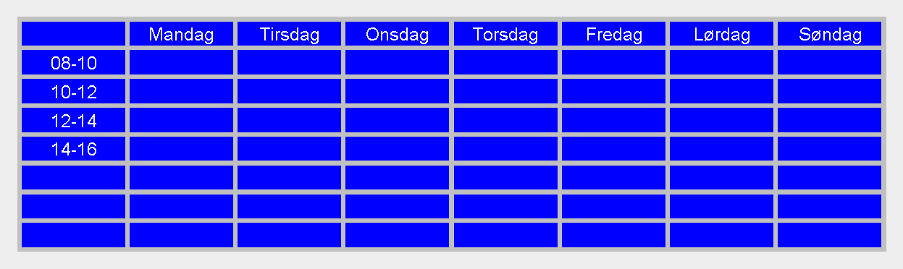

# Lab 5

## Læringsmål

- Bruke `generics`
- Kunne oversette ikke-generiske klasser til å bli generisk

## Intro
Generics er et viktig verktøy i Java og noe vi allerede har brukt så langt, uten å vite det. Du har sikkert brukt ``List<>`` og ``ArrayList<>`` til å holde en gruppe objekter. Det som er praktisk med disse er at de kan holde på hva som helst! Nettopp fordi de er *generiske*. Du kan sette et hvilket som helst typenavn i ``<>`` og listen vil da kunne holde på den typen objekter.

I denne laben skal vi ta utgangspunkt i ``ColorGrid`` fra lab4 og gjøre den generisk sammen med et nytt grid: TextGrid. Dette vil gjøre at vi kan lage grids for andre formål også, som vi kommer tilbake til i den første obligatoriske oppgaven. Filene til ColorGrid som følger med her er et løsningsforslag, men om du har en fungerende løsning fra forrige lab kan du gjerne bruke den i stedet.

I TextGrid kan man i stedet for farger, fylle en boks med en tekstbit, for eksempel et ord. Da kan du lage en ukekalender som dette:

## Steg for steg

Noen av oppgavene vil ved første inntrykk se litt lange ut, men det er mest på grunn av testene som du skal lime inn i etterkant av oppgaven. Så ikke ver redd for den tilsynelatende store tekstmengden.

1. [TextGrid vs ColorGrid](./guide/01-textgrid_vs_colorgrid.md)
2. [GridCell](./guide/02-gridcell.md)
3. [GridCellCollection](./guide/03-gridcellcollection.md)
4. [IGrid](./guide/04-igrid.md)
5. [Grid](./guide/05-grid.md)
6. [View](./guide/06-view.md)
7. [Main](./guide/07-main.md)
