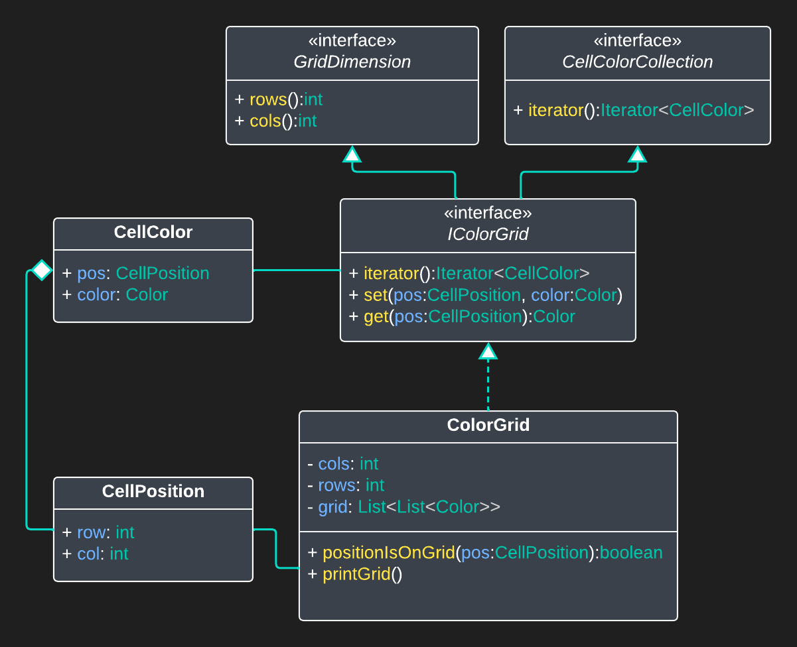
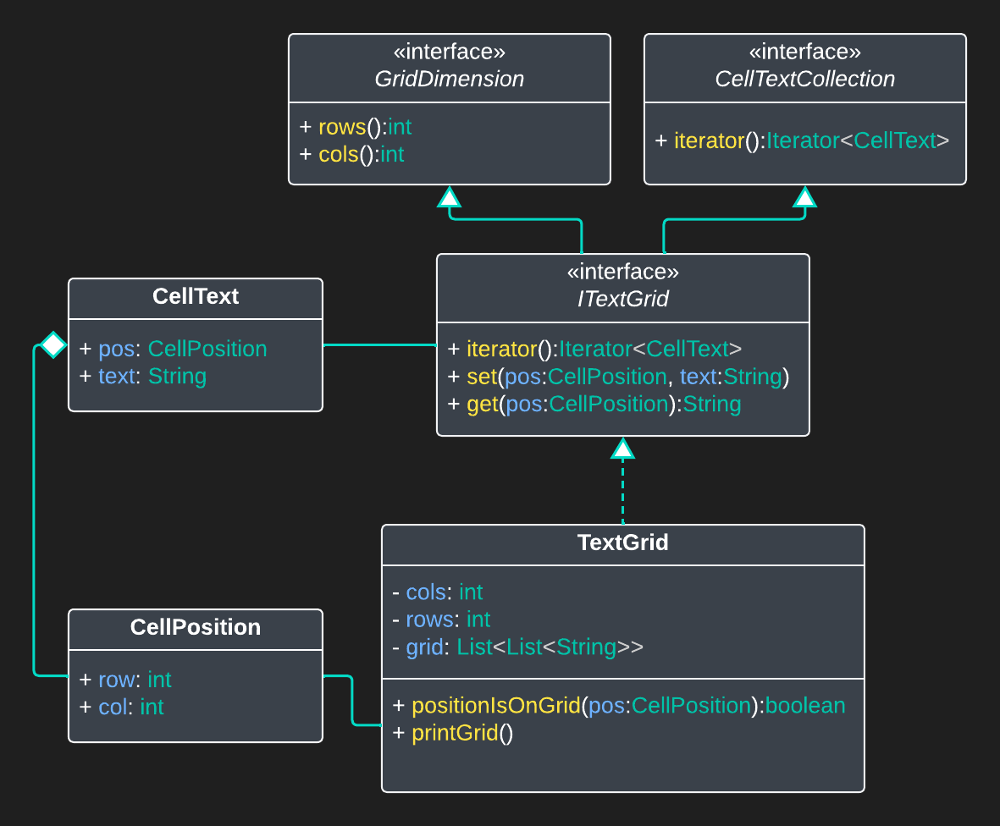

forrige &bullet; [oversikt](../README.md#steg-for-steg) &bullet; [neste](./02-gridcell.md)

## Oppgave 1: TextGrid vs ColorGrid

I lab 4 hadde vi denne strukturen som representerte gridet vårt:

- ``CellPosition`` - Record: En posisjon med row og col koordinat
- ``CellColor`` - Record: En **farge** på en posisjon
- ``CellColorCollection`` - Grensesnitt: Beskriver en samling av **CellColor** objekter
- ``GridDimension`` - Grensesnitt: Beskriver en struktur som har en mengde rekker og en mengde kolonner
- ``IColorGrid`` - Grensesnitt: Beskriver en 2d struktur av **farger** (Utvider ``CellColorCollection`` og ``GridDimension``)
- ``ColorGrid`` - Klasse: Implementerer en 2d struktur av **farger** (Implementerer ``IColorGrid``)

  

TextGrid er representert slik:

- ``CellPosition`` - Record: En posisjon med row og col koordinat
- ``CellText`` - Record: En **string** på en posisjon
- ``CellTextCollection`` - Grensesnitt: Beskriver en samling av **CellText** objekter
- ``GridDimension`` - Grensesnitt: Beskriver en struktur som har en mengde rekker og en mengde kolonner
- ``IColorGrid`` - Grensesnitt: Beskriver en 2d struktur av **strings** (Utvider ``CellTextCollection`` og ``GridDimension``)
- ``ColorGrid`` - Klasse: Implementerer en 2d struktur av **strings** (Implementerer ``ITextGrid``)

  
I `Main.java` har vi satt opp et `ColorGrid` og et `TextGrid`. For å få opp den ene eller andre i visningen når du kjører programmet kan du kommentere inn/ut linjene som deklarerer `view` objektet.

**TODO:**
* Se på klassediagrammene over for ColorGrid og TextGrid, og tilsvarende på koden i `datastructure` pakken. Tenk over hva disse strukturene har til felles. Er det mye like klasser, grensesnitt og kode? Hva ville du gjort for å gjøre koden mer generisk?
 

✅ Denne oppgaven er fullført når du har gjort deg kjent med filene i `datastructure` pakken.